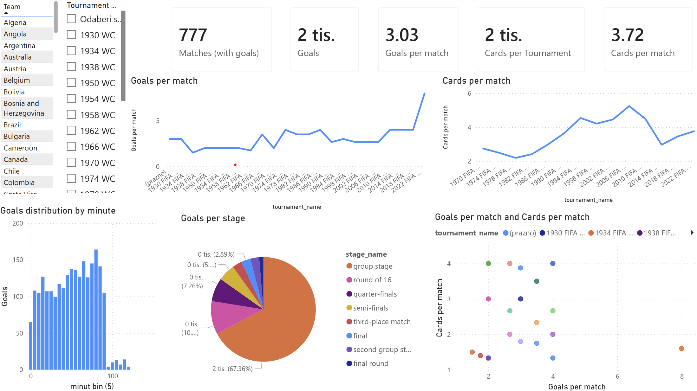

# World Cup Atlas - Data Visualization Project (FER)

Final project submission for the **Data Visualization** course (FER, MSc).  
Topic: **FIFA World Cup** data exploration and dashboard storytelling.

---

## Contents (this repository)
- **`WCVisData.pbix`** — Power BI dashboard (main deliverable)
- **`WCDataVis.pptx`** — project presentation slides
- **`VizPod3Lab.mkv`** — demo video / walkthrough
- **`FIFA_WC_dashboard.png`** — dashboard screenshot (preview)

---

## Dashboard preview

---

## How to view
### Power BI dashboard
1. Install **Power BI Desktop** (Windows).
2. Open `WCVisData.pbix`.
3. If Power BI asks for a data source/path, update it to match your local setup.

### Slides
Open `WCDataVis.pptx` in PowerPoint (or compatible viewer).

### Demo video
Open `VizPod3Lab.mkv` with any modern video player (e.g., VLC).

---

## Team
- Fran Galić  
- Dino Gabrić  
- Tomislav Pranjić  

---

## Notes
This repository contains the project artifacts used for academic submission.
